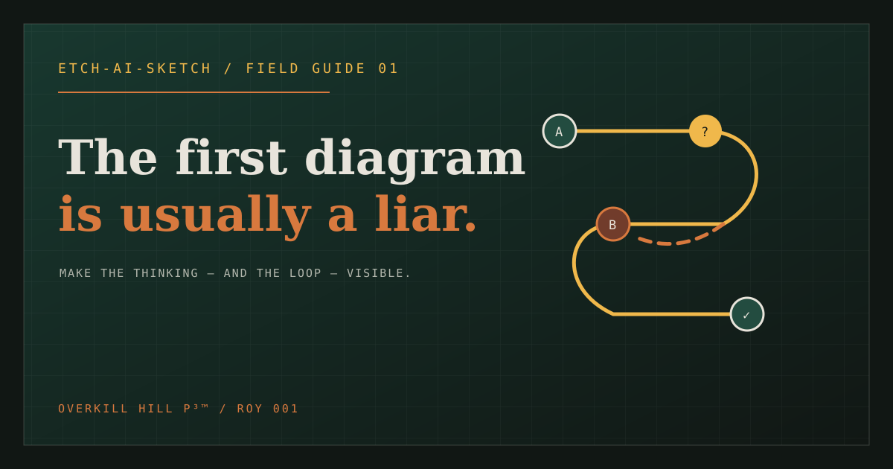

# The First Diagram Is Usually a Liar

**The Final Cut:** a practitioner case study of AI-assisted diagrams, structured
disagreement, reusable visual preferences, and maintainable process knowledge.

The first diagram is a claim. Make its assumptions, exceptions, and evidence
visible before its polish becomes a substitute for understanding.

## Read the Final Cut

- **[Final Cut reading edition](https://okhp3.github.io/first-diagram-is-a-liar/final-cut.html)**: the complete thesis with figures and sources, delivered alongside the field guide.
- **[Final Cut manuscript](docs/final-publication/master-article.md)**: the unified article candidate, approximately 10,900 words.
- **[Publication packet](docs/final-publication/README.md)**: website and LinkedIn candidates, announcement, source ledger, and review records.
- **[Website article](https://overkillhill.com/writings/first-diagram-is-a-liar/)** and **[LinkedIn article](https://www.linkedin.com/pulse/first-diagram-usually-liar-jamie-hill-lv3hc)**: existing public publication surfaces.
- **[Interactive tutorial](https://okhp3.github.io/first-diagram-is-a-liar/)**: the separate GitHub Pages application.
- **[Original evidence archive](archive/README.md)**: prompts, Mermaid sources, renders, decks, and historical records.

**Publication status:** this repository supplies the Final Cut reading edition and aligned field guide through its Pages workflow. The source packet retains its editorial review records.
Adding it to this repository does not replace the public website or LinkedIn
article. Those surfaces retain their previously published content until the
replacement is applied and verified. See the
[latest historical companion receipt](docs/linkedin/proto-posts/v0.9-bpmn-for-mermaid.md)
and the [current candidate manifest](docs/final-publication/candidate-manifest.json).

## What the Final Cut brings together

1. **ROY, Return on Your Words:** useful understanding relative to the effort of creating, reviewing, using, and maintaining an explanation.
2. **The Council experiment:** compare alternatives, preserve disagreement, and let a human adjudicate against evidence.
3. **Two diagram rounds:** Copilot V1 and Claude V2 are the author's round selections. Their strengths and defects remain inspectable.
4. **Business implementation:** actors, evidence, authority, exceptions, acceptance gates, stopping rules, and a complete illustrative purchase-request example.
5. **Knowledge behind the boxes:** link a Process Narrative Specification and selective diagram views through stable identifiers.
6. **Visual consistency:** use Theme Builder to establish choices, then carry them into generation through proposed personal skills or plugins with profiles, exemplars, and renderer-specific rules.
7. **Measurement and maintenance:** evaluate task accuracy, effort, styling correction turns, and change handling before claiming business benefit.

ROY is a heuristic, not a validated composite score. A separate net-benefit
calculation can be negative when costs exceed benefits. A valid render proves
neither process fidelity nor reader comprehension nor operational improvement.

The case preserves unequal product conditions and evolving prompts. It does
not establish universal model rankings or measured productivity gains. The
proposed personal styling package aims to bring known preferences into the first
prompt; identical rendering or native skill execution across every host is not
assumed.

## Projects and tools

| Resource | Understand it | Use or inspect it |
|---|---|---|
| Skillz Forge | [Project and approach](https://overkillhill.com/skillz-forge/) | [Browse the skill catalog](https://okhp3.github.io/skillz/) |
| Mermaid Theme Builder | [Styling workflow](https://overkillhill.com/projects/mermaid-theme-builder/) | [Open the workbench](https://okhp3.github.io/mermaid-theme-builder/) |
| BPMN for Mermaid | [Process-knowledge project](https://overkillhill.com/projects/bpmn-for-mermaid/) | [Explore the application](https://okhp3.github.io/mermaid-diagram-bpmn/) |
| Mermaid | [Open-source overview](https://mermaid.ai/open-source/) | [Upstream repository](https://github.com/mermaid-js/mermaid) |
| Agent Skills | [Format and ecosystem](https://agentskills.io/home) | [Specification repository](https://github.com/agentskills/agentskills) |
| Replit | [Build environment](https://replit.com) | Used for building and iteration in the case |
| Notion | [Knowledge workspace](https://www.notion.com) | Used for editorial organization and knowledge custody |

Project pages explain purpose and boundaries; application links open the working
surfaces; upstream repositories provide source and contribution routes. Links
and topic tags identify resources, not endorsements or universal compatibility.

#OverKillHill #SkillzForge #MermaidThemeBuilder #BPMNForMermaid #Mermaid #AgentSkills #Replit #Notion #ProcessImprovement #VisualCommunication

## Diagram rounds and evidence

**V1 and V2 identify diagram rounds.** They remain part of the evidence. Historical
article-release labels are retained in the archive and receipts, while the Final
Cut follows the argument rather than the release chronology.

Keep the **Core Five**, **Specialty**, **Exhibition**, and **Attempted** entries
distinct. The historical [Council brief](archive/diagramming-shootout/council-brief.md),
[canonical story](archive/diagramming-shootout/canonical-story.md), and
[diagram manifest](archive/diagramming-shootout/diagram-manifest.csv) preserve the
case. The Final Cut's [source ledger](docs/final-publication/source-ledger.md)
explains the bounded current interpretation and corrections.

Historical sources are preserved rather than silently repaired. For example,
Claude V2's missing negative decision route remains in the original source and
render, with its significance explained beside the selected figure.

## Run the tutorial

### Display, pin, and share

The header includes a GitHub source link and **Light / System / Dark** controls.
System is the default. Your appearance choice is saved on this device separately
from the tutorial session. It follows operating-system changes while System is
selected.

- **iPhone/iPad:** Safari's Share menu, then Add to Home Screen. The shortcut uses
  the `First Diagram` name and a dedicated 180px Apple icon.
- **Android:** use the browser's install or Add to Home Screen action when offered.
  The manifest supplies regular icons and a separate opaque, maskable 512px icon.
- **Shared links:** the field guide and Final Cut reading page expose absolute
  Open Graph and large Twitter/X card image URLs. Preview refresh timing belongs
  to the receiving platform.

Home-screen launch needs a network connection; offline caching is not provided.
Availability and wording of installation actions depend on the browser.

[](https://okhp3.github.io/first-diagram-is-a-liar/)

[Share image](public/og-image.png) · [Apple icon](public/apple-touch-icon.png) ·
[Android maskable icon](public/icon-maskable-512.png) ·
[Web manifest](public/site.webmanifest) ·
[GitHub repository preview asset](public/github-social-preview.png)

See the [presentation comparison and delivery notes](docs/presentation-polish.md)
for the reference-app comparison and asset boundaries. GitHub's repository
social-preview setting is separate from the application's share metadata.

```bash
npm ci
npm run dev
```

The application walks through the premise, an illustrative ROY calculation and reader-task measurement,
a source-first V1/V2 workbench, a personal visual-profile exercise, Council conditions,
and a business handoff with process ownership and exception handling.
Browser storage can preserve the local session's premise, controls, revision,
synthesis, checklist, and handoff activity. The tutorial is a separate learning
surface aligned with the Final Cut; the complete reading edition is generated from the same committed article body. See the [alignment record](docs/final-cut-spa-alignment-2026-09-29.md).

The handoff step offers two deterministic Markdown packets:

- `first-diagram-is-a-liar-handoff.md`: full local tutorial state, including premise, ROY, workbench, Council, checklist, next test, receipts, generated date, and schema version.
- `first-diagram-is-a-liar-handoff-redacted.md`: structural receipts and privacy boundaries, omitting the learner-entered bounded claim, synthesis sentence, and next test.

Both are assembled in the browser. They provide neither cloud backup nor durable
server storage nor a verdict. Redacted is the default; full export requires deliberate confirmation.

## Repository map

```text
src/                         interactive tutorial application
docs/final-publication/       Final Cut master, surface candidates, evidence and review
archive/
  diagramming-shootout/       brief, prompts, V1/V2 sources, images, decks
  member-deliberations/      specialty-role records
  editorial-cut/             historical prepared HTML cut
  legacy-exports/            preserved source captures
docs/                        roadmap, technology records, historical companion posts
public/                      icons and social-preview assets
scripts/                     archive, Mermaid and post-merge checks
.agents/skills/              repository-local Agent Skill assets
.github/workflows/           GitHub Pages build and deploy
```

## Validation

```bash
npm run check
npm run build
npm run check:archive
npm run check:campaign-evidence
npm run health:mermaid
npm run test:acceptance
git diff --check
```

### Local browser acceptance

`npm run test:acceptance` starts a temporary local Vite server and drives the
actual tutorial in headless Chromium. It covers the five-step journey, bounded
premise capture, ROY recalculation, revision-loop visibility, source-first V1/V2
comparison, Council condition labels and synthesis, checklist completion and
reload persistence, malformed-state recovery, hash/history navigation,
clipboard failure feedback, full and redacted local Markdown handoff content
and deterministic naming, keyboard-facing semantics, and the 390px narrow
viewport. The handoff assertions capture the browser-generated Blob locally;
they do not upload handoff text or diagram state.

The command needs a locally installed Chromium or Chrome executable. Chromium
is available in the Replit development environment; on another machine, set
`CHROMIUM_PATH` to the executable path when it is not on `PATH`. It uses no
credentials, analytics, private sources, hosted test service, or deployment.
This is a local acceptance check, not a GitHub Pages or hosted-renderer smoke
test.
It blocks the external font services and exercises the application's fallback
fonts, so an unavailable font CDN cannot stall functional acceptance.

The GitHub Pages workflow (`.github/workflows/deploy-pages.yml`) builds the
root app with the production base `/first-diagram-is-a-liar/` on every push
to `main` or manual dispatch. The successful Actions run and Pages smoke test
are recorded in the dated final evidence gate and current hosted evidence:
[`docs/final-evidence-gate-2026-08-27.md`](docs/final-evidence-gate-2026-08-27.md);
this repository makes no claim of `.replit.app` publication.

After a task merge, the environment runs `scripts/post-merge.sh`. It installs
from the committed npm lockfile, typechecks, builds, and reruns the archive and
Mermaid checks. The hook is root-only because this repository has no backend,
database, or secondary artifact.

## Technology maintenance

The [technology inventory and update plan](docs/technology-inventory.md) lists
the application, tooling, archive formats, current versions and official stable
releases. Run `npm run audit:technologies` for a fresh comparison; reports are
written to `.local/technology-review/`.

The configured weekly Dependabot checks propose npm and GitHub Actions updates.
Pull requests run the full validation and browser acceptance checks. A separate
weekly technology review covers runtime selectors and archive authoring tools.
CI reads the Node LTS major from `.nvmrc`; Replit modules are verified separately.
The maintainer reviews and merges passing updates before Pages deployment.

Use the [Git synchronization runbook](docs/git-synchronization.md) to keep the
Windows checkout and Replit on the published `main`, preserve unfinished work,
and distinguish Shell transport from Replit connector authentication.

## License and provenance

The Mermaid source files are provided for reference, learning, and adaptation.
Article text, brand assets, and slide deck content remain © OverKill Hill P³™.
See the archive provenance notes before reusing material.
