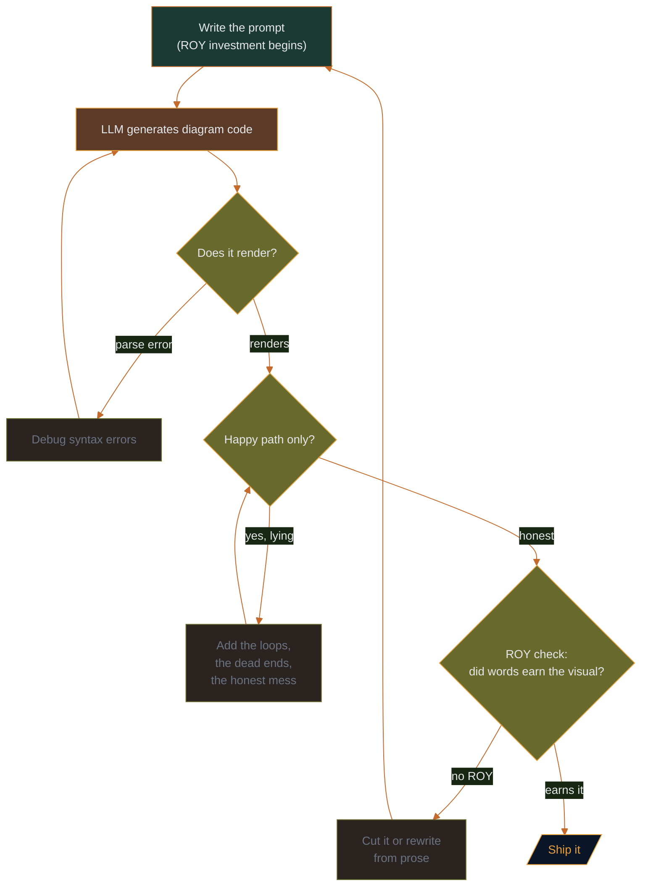

# Replit V1 — Round 1 Submission (Archived)

**Model:** Replit Auto
**Member folder:** `member-deliberations/replit/`
**Round:** Round 1 / V1
**Conditions:** Late-entry specialty submission; exact session date is not recorded
**Contribution:** First builder-focused Mermaid draft preserved by the human editor
**Source:** This Markdown record; matching source/render are indexed in the [diagram manifest](../../etch-ai-sketch-vibe-diagramming-shootout/diagram-manifest.csv)
**Archive status:** Archived submission; not a public article or deployment
**Judge verdict:** The builder's eye — does it ship, does it render, does it survive the IDE?
**Tags:** Code-first thinking · Runtime honesty · Builder pragmatism

**Canonical status:** Late-entry specialty-role archive; not part of the
initial Core Five comparison. Editable source and rendered-artifact links are
tracked in the [diagram manifest](../../etch-ai-sketch-vibe-diagramming-shootout/diagram-manifest.csv).

---

## Diagram

---

## Builder's Notes

The first diagram is always a liar because the first prompt assumes a happy path.

The gate that matters is not "does it render" — that's just syntax. The gate that matters is "does it show the loop where things break." Most diagrams skip that gate. Most prompts never ask for it.

ROY — Return on Your Words — is the ratio of visual insight gained to prompt investment made. A diagram that only shows the happy path has negative ROY. The words cost something. The visual earned nothing the prose didn't already say.

The fix is not a better prompt. The fix is an honest question: *what actually happens when this breaks?*

---

*Round 1 · ETCH-AI-SKETCH Vibe-Diagramming Shootout · OverKill Hill P³*
